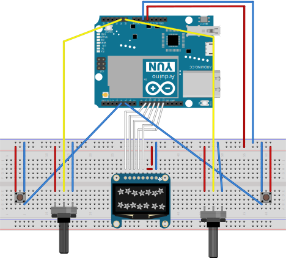
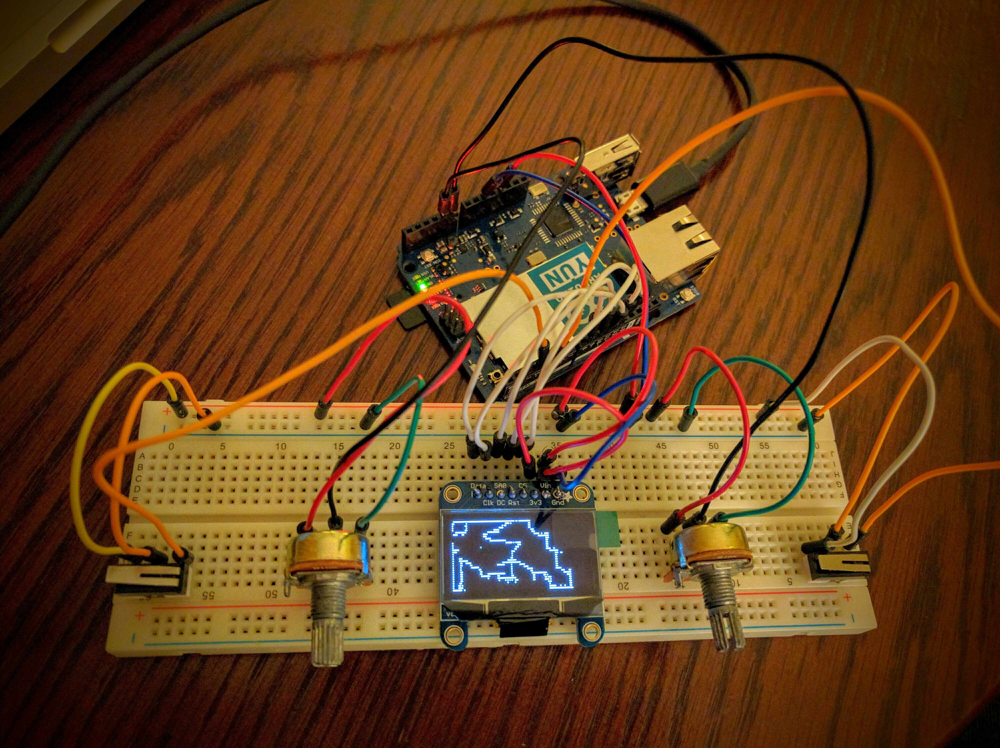

Etch A Sketch
======================================

**What?**

Draw pictures on a 128x32 LCD display using potentiometers (A0,A1), buttons will clear your sketch (pin 4) or 
will switch between drawing modes (draw/move only) via pin 5

**Parts**

- Arduino UNO
- USB cable
- LCD display (Adafruit_SSD1306), size 128x32
- Male to Male Breadboard Jumper Cable Wires x 22
- Breadboard
- 2 Potentiometers
- 2 Tactile Switch Buttons

**Code**

Source code in `main` needs to be uploaded to the board. Required libraries included in `lib` folder 
which need to be imported via Arduino IDE.

